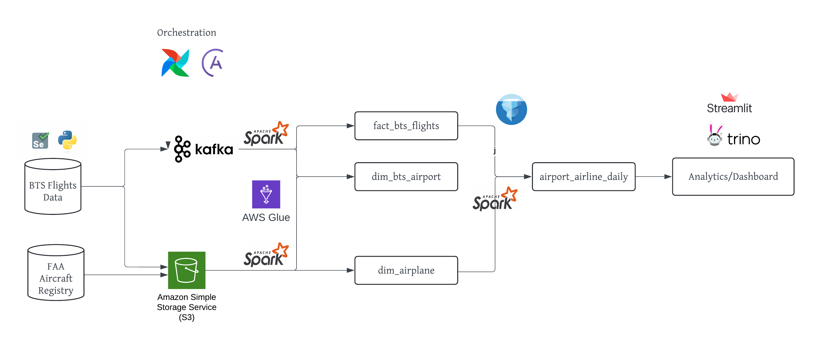
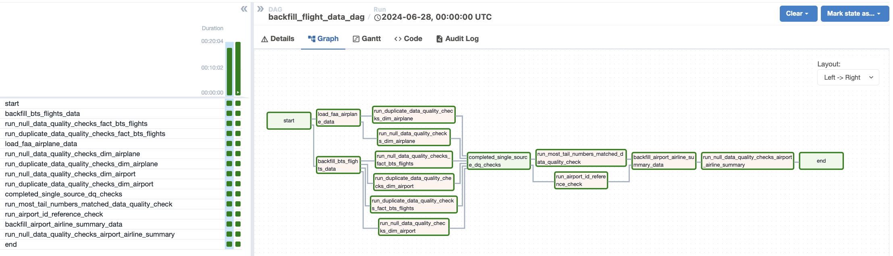
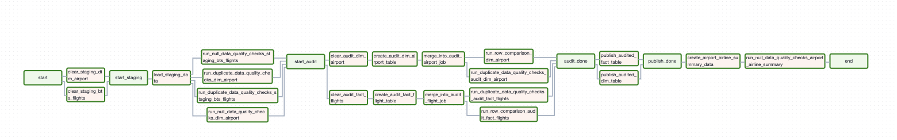
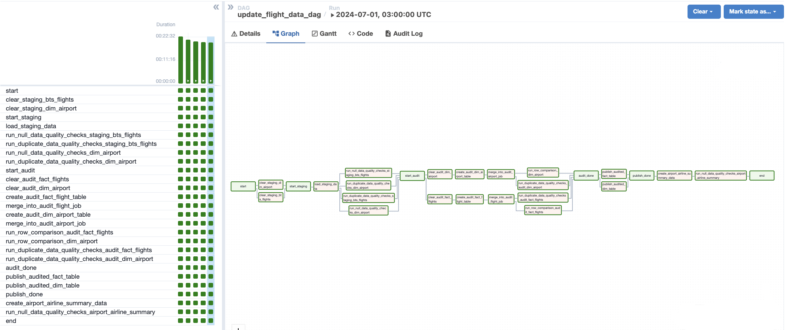
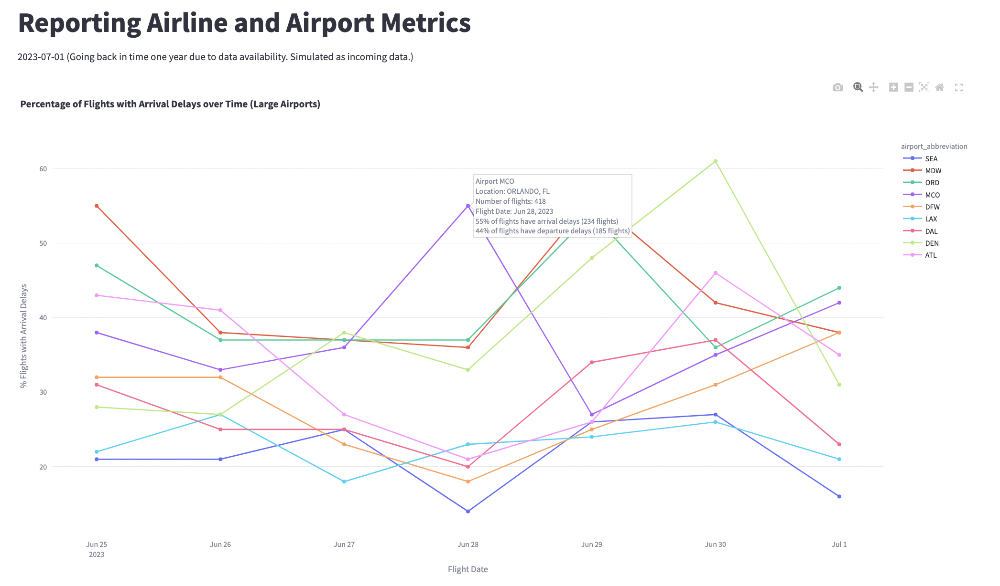
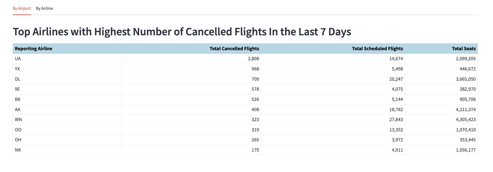
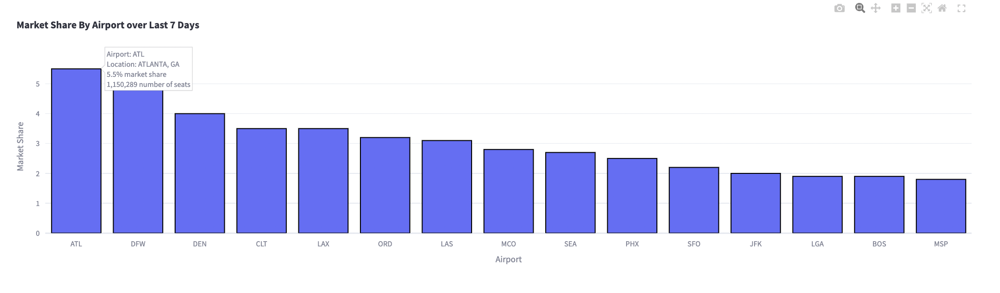

# On Time Flight Data Reporting

Airports are economic gateways to the cities they serve and tracking trends in air travel is crucial for determining key performance indicators for the region. The Bureau of Transportation Statistics (BTS) provides access to the on time performance flight database which serves as a proxy for real-time data in order to demonstrate how this data pipeline could be used. The BTS data contains detailed flight-level information for the majority of commercial air travel in the United States. In this project, I build a data pipeline for ingesting flight data in a general way and build a simple dashboard from its results to demonstrate the type of metrics cities and airports could track given access to this information.

The Bureau of Transportation Statistics (BTS) publishes flight data that lags by a few months. For the purpose of this project, I backfill the tables with past data and stream more recent records to simulate a real-time source since real time streaming data is not publicly available. This data can be merged with the Federal Aviation Administration (FAA) Releasable Aircraft Data to know the number of seats on each flight. Combined, this data provides an estimate of the number of passenger seats available for each airline and airport in the US. Additional load data could also be merged in to provide an estimate of the number of passengers, but this exercise is left for future work.

Data Sources:

- Bureau of Transportation Statistics (BTS)
- Federal Aviation Administration (FAA)

Datasets used in project:

1. Reporting Carrier On-Time Performance (BTS)

- Report scheduled & actual departure/arrival times for non-stop domestic flights by month and year
- Includes canceled and diverted flights, causes of delay and cancelation, and air time
- Includes US certified air carriers that account for at least half of one percent of domestic scheduled passenger revenues

2. Releasable Aircraft Database (FAA)

- Text files containing detailed registered commercial aircraft information, such as number of seats

Initial project work seeks to answer the following questions:

- What are the top airlines with the highest number of cancellations/delays over a window of time?
- What are the airports with the highest number of cancellations/delays over a window of time?
- What is the market share for airports? How is this changing over time?

Understanding the number of flights and available seats is just a starting point. As mentioned, future work could combine other information from BTS, such as the DB100 database, that contains monthly load information that describes the average percent of passengers on the plane by route, airline, and month. This information, while course, allows for the most accurate measure of the number of passengers that are on each flight. This in turn could be used to improve the market share calculations. Also efficiently transporting people though the airport requires a passenger forecast in order to most closely match the number of Transportation Security Association (TSA) personnel, the number and frequency of airport shuttle systems, and personnel for terminal services. Combining day-ahead flight schedules with load estimates could facilitate estimating the number of passengers an airport will see throughout the day, enabling the airport to plan its operations efficiently. This could be combined with streaming data updates during times of inclement weather to forecast passenger flow volumes.

## Data and Architecture

  

The BTS Reporting Carrier On-Time Performance data is used to create fact_bts_flights table (flight event data) and dim_bts_airport table (dimensional airport data). Previous years' data can be backfilled using csvs of data scraped from their website. Since real time streaming data for airport flights is not publicly available, Kafka was used to simulate data arriving over time for batch processing. Spark was chosen for its ability to scale to process large amounts of data, integrate with Kafka, and because it would not be difficult to switch from batch processing to streaming as needed.

The FAA Releasable Aircraft Data was used to produce dim_airplane (dimensional airplane data). Spark wasn't necessary for this size data (nor will it scale out dramatically over time), but to keep the pipeline more homogenous it was used.

Astronomer and airflow were used to schedule running the ETL pipeline.

An analytics table, airport_airline_daily, is produced using data from both sources, fact_bts_flights and dim_airplane, to facilitate answering the questions mentioned above as well as other questions of interest to stakeholders and analysts. This table has summary metrics at an airport & airline level for each day such as the number of cancellations and the number of outgoing flights for a given airline and given airport on a given day.

## Output Tables, Schemas & Daily Quality Checks

### airport_airline_daily:

| Field Name                               | Type    | Comments                                                                                                                         |
| :--------------------------------------- | :------ | :------------------------------------------------------------------------------------------------------------------------------- |
| reporting_airline\*                      | varchar | unique carrier code                                                                                                              |
| flightdate\*                             | date    | partition key                                                                                                                    |
| airport_id\*                             | bigint  | airport identifier                                                                                                               |
| n_flights\*                              | bigint  | number of flights scheduled to depart for given airline from given airport on given flight date                                  |
| n_dep_delay\*                            | bigint  | number of departure delays experienced for given airline from given airport on given flight date                                 |
| n_arr_delay\*                            | bigint  | number of arrival delays experienced for given airline from given airport on given flight date                                   |
| n_cancelled\*                            | bigint  | number of cancelled flights for given airline from given airport on given flight date                                            |
| n_diverted\*                             | bigint  | number of diverted flights for given airline from given airport on given flight date                                             |
| n_diverted_reached_destination flights\* | bigint  | number of diverted flights for given airline from given airport on given flight date that reached the expected final destination |
| n_carrier_delay                          | bigint  | number of flights with carrier delays of 15+ minutes for given airline from given airport on given flight date                   |
| n_weather_delay                          | bigint  | number of flights with weather delays of 15+ minutes for given airline from given airport on given flight date                   |
| n_nas_delay                              | bigint  | number of flights with national aviation system delays of 15+ minutes for given airline from given airport on given flight date  |
| n_security_delay                         | bigint  | number of flights with security delays of 15+ minutes for given airline from given airport on given flight date                  |
| n_late_aircraft_delay                    | bigint  | number of flights with late aircraft delays of 15+ minutes for given airline from given airport on given flight date             |
| n_seats                                  | bigint  | total number of seats on all flights for given airline from given airport on given flight date                                   |

Data quality checks:

- Starred columns have data checks to ensure there are no null values.

### dim_bts_airport:

| Field Name                | Type    | Comments                                                                             |
| :------------------------ | :------ | :----------------------------------------------------------------------------------- |
| airport_id\*              | integer | airport identifier                                                                   |
| city_market_id\*          | integer | city market identifier; can use to consolidate airports serving the same city market |
| airport_abbrev\*          | varchar | airport abbreviation                                                                 |
| airport_location\*        | varchar |                                                                                      |
| airport_state\*           | varchar |                                                                                      |
| airport_world_area_code\* | integer |                                                                                      |

Data quality checks:

- No duplicates. There are not multiple rows for a single `airport_id`.
- Starred columns have data checks to ensure there are no null values.
- Ensure for all `origin_airport_id` and `dest_airport_id` values in `fact_bts_flights`, all identifiers are in `dim_bts_airport`.

### dim_airplane:

| Field Name        | Type    | Comments                                                                     |
| :---------------- | :------ | :--------------------------------------------------------------------------- |
| faa_tail_number\* | varchar | Federal Aviation Administration registry identification assigned to aircraft |
| mfr_year          | integer | year aircraft was manufactured (sometimes null)                              |
| manufacturer\*    | varchar | aircraft manufacturer                                                        |
| model\*           | varchar | aircraft model                                                               |
| n_seats\*         | integer | number of seats in aircraft                                                  |

Data quality checks:

- No duplicates. There are not multiple rows for a single `faa_tail_number`.
- Starred columns have data checks to ensure there are no null values.
- Not all aircrafts in `fact_bts_flights` are present in the FAA data. Check that only a small percentage of aircrafts in `fact_bts_flights` have tail numbers not appearing in `dim_airplane`. Check fails if more than 10% aren't in FAA data.

### fact_bts_flights:

| Field Name                        | Type    | Comments                                                                                                             |
| :-------------------------------- | :------ | :------------------------------------------------------------------------------------------------------------------- |
| flightdate\*                      | varchar | partition key                                                                                                        |
| reporting_airline\*               | varchar | unique carrier code                                                                                                  |
| tail_number                       | varchar | nullable                                                                                                             |
| faa_tail_number                   | varchar | nullable                                                                                                             |
| flight_number_reporting_airline\* | bigint  | flight number                                                                                                        |
| origin_airport_id\*               | bigint  | identification number assigned by US DOT to identify a unique airport                                                |
| dest_airport_id\*                 | bigint  | identification number assigned by US DOT to identify a unique airport                                                |
| sch_dep_time\*                    | bigint  | scheduled departure time (local)                                                                                     |
| dep_time                          | bigint  | actual departure time (local)                                                                                        |
| dep_delay                         | bigint  | difference in minutes between scheduled and actual departure time                                                    |
| taxi_out                          | bigint  | taxi out time in minutes                                                                                             |
| wheels_off                        | bigint  | wheels off time (local)                                                                                              |
| wheels_on                         | bigint  | wheels on time (local)                                                                                               |
| taxi_in                           | bigint  | taxi in time in minutes                                                                                              |
| sch_arr_time                      | bigint  | scheduled arrival time (local)                                                                                       |
| arr_time                          | bigint  | actual arrival time (local)                                                                                          |
| arr_delay                         | bigint  | difference in minutes between scheduled and actual arrival time                                                      |
| cancelled                         | integer | cancelled flight indicator (1=Yes)                                                                                   |
| cancellation_code                 | varchar | specifies reason for the cancellation                                                                                |
| diverted                          | integer | diverted flight indicator (1=Yes)                                                                                    |
| sch_elapsed_time                  | bigint  | scheduled elapsed flight time in minutes                                                                             |
| actual_elapsed_time               | bigint  | actual elapsed time of flight in minutes                                                                             |
| air_time                          | bigint  | flight time in minutes                                                                                               |
| n_flights                         | integer | number of flights                                                                                                    |
| distance                          | bigint  | distance between airports in miles                                                                                   |
| carrier_delay                     | bigint  | length of carrier delay in minutes                                                                                   |
| weather_delay                     | bigint  | length of weather delay in minutes                                                                                   |
| nas_delay                         | bigint  | length of national aviation systems delay in minutes                                                                 |
| security_delay                    | bigint  | length of security delay in minutes                                                                                  |
| late_aircraft_delay               | bigint  | length of late aircraft delay in minutes                                                                             |
| total_away_ground_time            | bigint  | total ground time away from gate for gate return or cancelled flight                                                 |
| longest_away_ground_time          | bigint  | longest time away from gate for gate return or cancelled flight                                                      |
| div_airport_landings              | integer | number of diverted airport landings                                                                                  |
| div_reached_dest                  | integer | diverted flight reaching scheduled destination indicator (1=Yes)                                                     |
| div_actual_elapsed_time           | bigint  | elapsed time of diverted flight reaching scheduled destination in minutes                                            |
| div_arr_delay                     | bigint  | difference in minutes between scheduled and actual arrival time for a diverted flight reaching scheduled destination |
| div_distance                      | bigint  | distance between scheduled destination and final diverted airport in miles                                           |

Data quality checks:

- Starred columns have data checks to ensure there are no null values.
- No duplicates. There are not multiple rows for identifier (`flightdate`, `reporting_airline`, `flight_number_reporting_airline`, `sch_dep_time`,`origin_aiport_id`, `dest_airport_id`).

## Dags

### Backfilling

There are years and years of BTS data that can be processed. Using the backfill flow, the data can be processed from csv/txt files and loaded into the previously discussed tables to support analytical needs.

### Batch Processing New Data

More interesting use cases would have data flowing in in real-time so the impacts of delays, cancellations, weather, etc could be taken into consideration with respect to staffing, curbside flow, and other factors that fluctate as the passenger flow changes. Combining kafka with spark allows for batch processing. In this example, data prior to June 2023 was loaded via batch processing and then additional data was simulated as "arriving" and processed via the batch processing pipeline. If real-time data was available and airports had a need to forecast real-time volumes this could be adjusted to be a streaming pipeline.

## Analysis/Dashboard

Below are some sample screenshots from a Streamlit dashboard using the analytics table `airport_airlines_daily`. Flashing back in time to a year ago (in 2023) since the real-time data flow was simulated using data from a year ago. We can see the air traffic chaos that occured with relatviely high numbers of delays and cancellations.

For the market share calculations below, the number of seats was used. However future improvements would use other BTS data sources to estimate the load and improve the calculations here by imputing the number of passengers aboard rather than using the number of seats.

